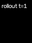
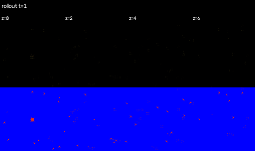
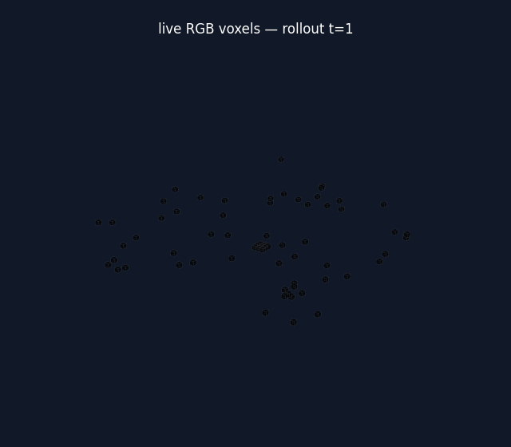

# 3D Conv NCA validation

Examples from the latest completed `3d_nca16_face0_dodrio_64` validation at
step 59,500. The RGB voxel view is a qualitative reconstruction preview; it
still shows some lattice noise at this checkpoint.

## Reconstructed face

## Depth slices

## RGB voxel volume

